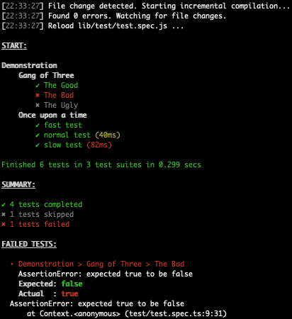

# Mark's Own Test Runner (MOTR)

This is a Proof of Concept (as of now) for a simple and stupid re-implementation of [Web Test Runner](https://modern-web.dev/docs/test-runner/overview/) (WTR).

## Why?

* I love WTR
* WTR's implementation is not simple and stupid
* WTR sometimes freezes for several minutes on macOS
* I'd like to extend the mocha reporter protocol
* I'd like to run the Typescript compiler and WTR both in watch mode in the same terminal within Visual Studio Code

## How?

* [mocha](https://mochajs.org) (test runner)
* [puppeteer](https://github.com/puppeteer/puppeteer) (browser)
* node.js' httpd (instead of [koa](https://koajs.com))
* typescript (instead of [esbuild](https://esbuild.github.io) because it has the best language support and is actually quite fast when run in watch mode)
* ECMAScript modules: TBD, just PoC now
* watch mode: TBD, just PoC now
* mocha reporter: TBD, just PoC now
